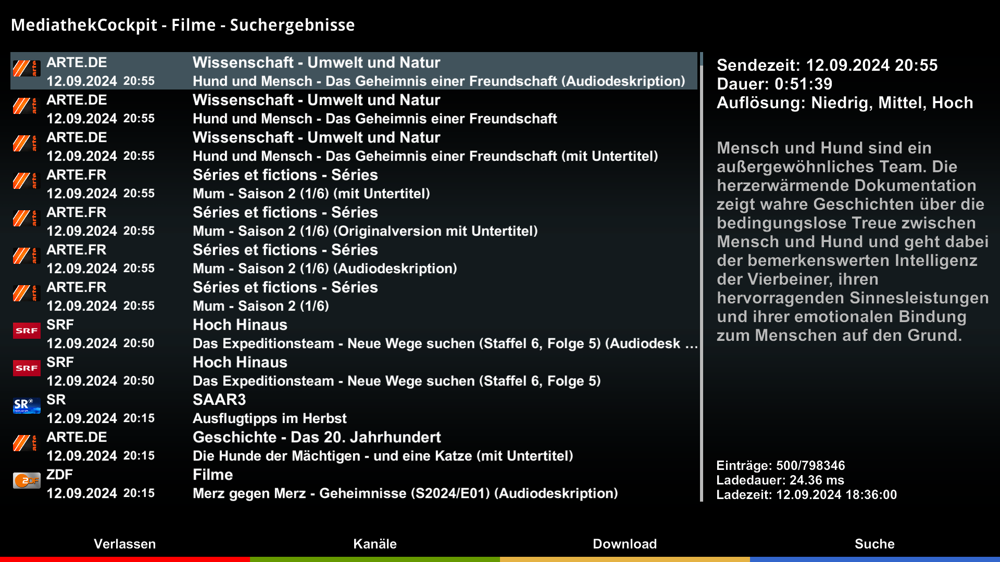
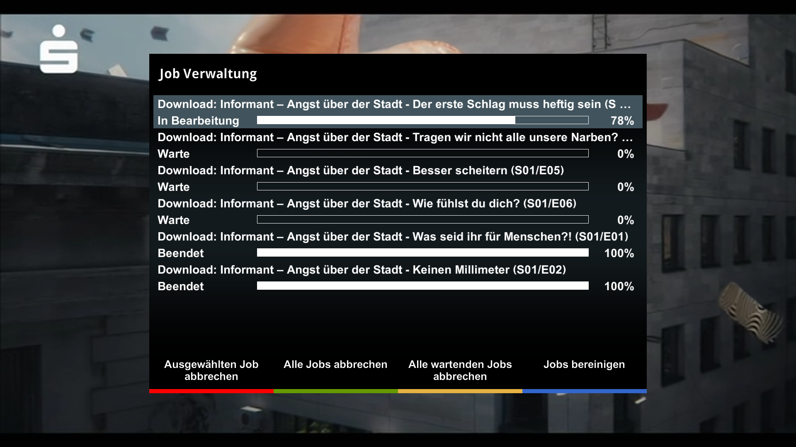

# MediathekCockpit (MTC)
DreamOS plugin to browse Mediathek libraries and download movies.

## Features
- Plays back Mediathek video files.
- Searches for media files manually or from EPG using blue button.
- Downloads Mediathek video files.
- Supports HD, FHD, and WQHD skin resolutions.

## Languages
- english
- german

## Links
- Installation: https://dream-alpha.github.io/MediathekCockpit
- Support: https://github.com/dream-alpha/MediathekCockpit/discussions
- Package feed: https://gemfury.com/dream-alpha
